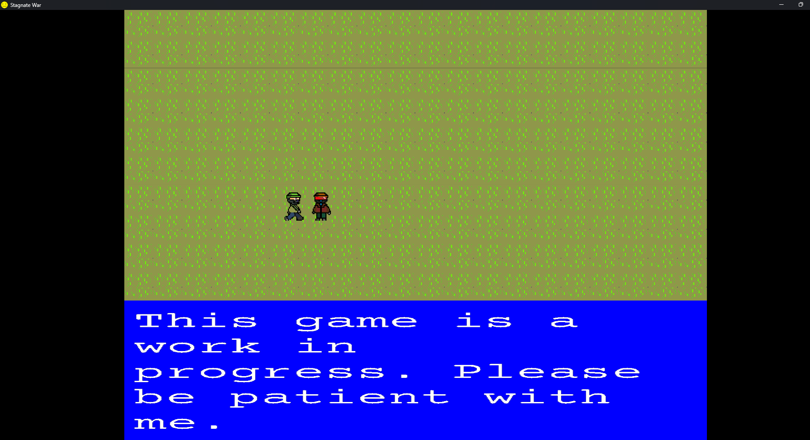

# SDL3 Game Project

This is a work-in-progress game project built using Visual Studio 2022, leveraging SDL3 and its associated libraries. The assets for this project were created using Aseprite. Below are the details of the libraries in use and the current status of the project.

## Libraries in Use

- **SDL3_image-3.2.4**: Handles loading of various image formats (e.g., PNG, JPEG, WEBP) as SDL surfaces and textures.
- **SDL3_ttf-3.2.2**: Enables the use of TrueType fonts in the application.
- **SDL3-3.2.10**: The core SDL3 library providing the foundation for this project.

For more information on SDL3 and its libraries, visit the [SDL Libraries Wiki](https://wiki.libsdl.org/SDL3/Libraries).

## Project Status

This project is currently a work in progress. Development is ongoing, and additional features and refinements will be added over time.

## Tools

- **Visual Studio 2022**: Used as the primary IDE for development.
- **Aseprite**: Used to create the project assets.

## Future Plans

- Continue expanding game functionality.
- Optimize performance and refine assets.
- Add more features as development progresses.

## Images

